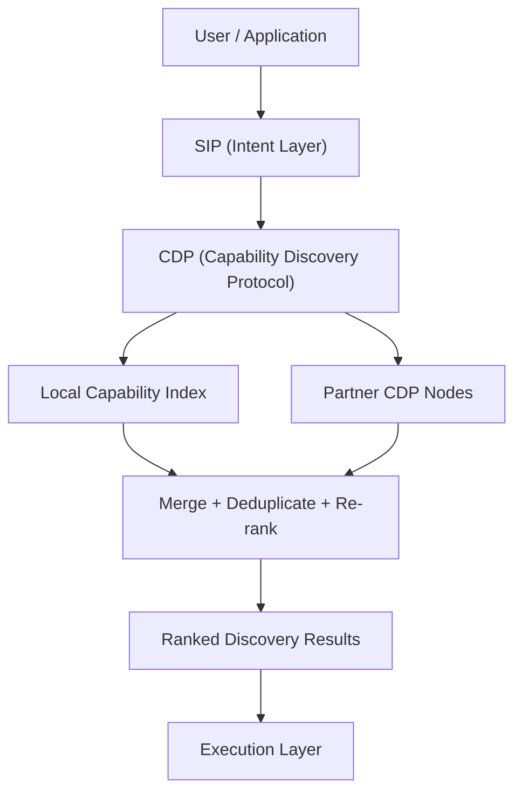

# Architecture

## CDP Architecture Overview



## System Components

```
┌─────────────────────────────────────────────────────────┐
│                    CDP Service                           │
│                                                         │
│  ┌──────────┐  ┌──────────┐  ┌──────────┐              │
│  │  Intent   │  │ Registry │  │ Matching │              │
│  │  Parser   │  │  Store   │  │ Pipeline │              │
│  └──────────┘  └──────────┘  └──────────┘              │
│                                                         │
│  ┌──────────┐  ┌──────────┐  ┌──────────┐              │
│  │ Ranking  │  │ Policy   │  │Federation│              │
│  │ Scorer   │  │ Engine   │  │ Client   │              │
│  └──────────┘  └──────────┘  └──────────┘              │
│                                                         │
│  ┌──────────┐  ┌──────────┐                            │
│  │  Audit   │  │ FastAPI  │                            │
│  │  Logger  │  │   API    │                            │
│  └──────────┘  └──────────┘                            │
└─────────────────────────────────────────────────────────┘
```

## The 14-Stage Pipeline

| Stage | Name | Description |
|-------|------|-------------|
| 1 | `parse_request` | Validate and deserialize the DiscoveryIntent |
| 2 | `normalize_intent` | Normalize whitespace and text |
| 3 | `extract_constraints` | Extract keywords and structured constraints |
| 4 | `retrieve_candidates` | Load all active offerings from registry |
| 5 | `deterministic_filtering` | Apply hard constraints (price, region, etc.) |
| 6 | `semantic_matching` | Score candidates by keyword relevance |
| 7 | `capability_validation` | Verify provider supports the category/region |
| 8 | `policy_filtering` | Apply trust and compliance policies |
| 9 | `ranking` | Compute weighted scores across all dimensions |
| 10 | `explanation_generation` | Build human-readable score explanations |
| 11 | `federation_merge` | Merge results from federated nodes |
| 12 | `deduplication` | Remove duplicate offering_ids |
| 13 | `audit_logging` | Write DiscoveryAuditRecord |
| 14 | `response_generation` | Assemble and return DiscoveryResponse |

## Key Design Decisions

### In-Memory Registry with TTL
The default registry is in-memory for simplicity and speed. TTL-based expiry ensures stale entries are automatically removed. Production deployments can swap in persistent backends.

### Keyword-Based Semantic Matching
The v0.1 semantic engine uses keyword matching for speed and determinism. Future versions may integrate vector embeddings.

### Pluggable Policy Engine
Policies are implemented as composable rules. The default rules enforce active-only offerings and verified providers.

### Sync + Async Federation
The pipeline runs synchronously locally. Federation queries remote nodes asynchronously with configurable timeouts.
